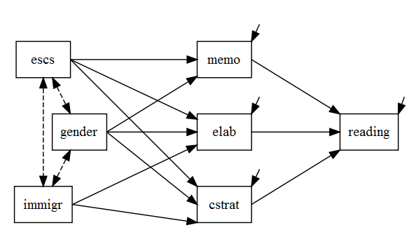
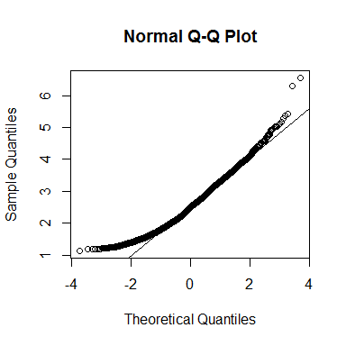
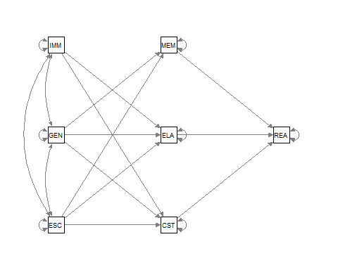
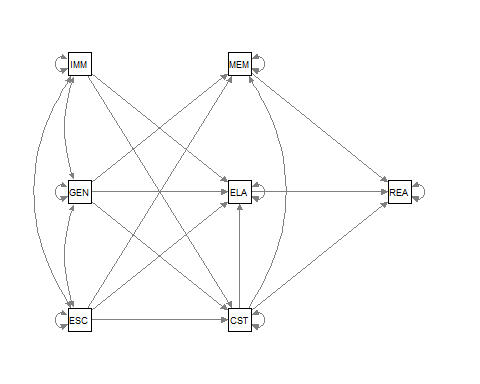

# Problem Set 1
Tristan Mahr  
February 26, 2015  


***

## Part 1: Responses to Individual Questions

### Provide three indications that the model in the figure is identified




1. The model satisfies two **prerequisites for regression**: 1) latent variables
(and disturbances) have a scale and 2) paths among the endogenous variables are
normalized, meaning that no endogenous variable has a direct effect on itself.

2. The model satisfies the **counting rule** (a necessary condition for
identification). There are 7 variables in the model, so there are (7 * 8) / 2 =
28 elements in the lower triangle and diagonal of the covariance matrix. This
model has 21 free parameters, so there are 7 degrees of freedom. This model is
therefore overidentified.

3. Most importantly, this model is **recursive**, meaning that the there are no
feedback loops among the endogenous variables nor are there paths connecting the
disturbances of the endogenous variables. In matrix terminology, the values to
be estimated in **B** are in the lower triangle of the matrix and covariance
matrix for the disturbances is a diagonal matrix. Recursive models are
identified.

This model is an overidentified recursive model, so it is identified.


### Determine if the data meet the assumptions of multivariate normality. Provide evidence to support your conclusion.


```r
options(stringsAsFactors = FALSE)
library("psych")
library("MVN")
library("dplyr")

# The pipe operator %>% from dplyr means use the value on the lefthand side as
# the first parameter to the function on its righthand side. So x %>% f(y) is
# the same as f(x, y)
d <- read.csv("data/pisa09.csv", na.strings = "9999") %>%
  # Listwise deletion
  na.omit %>%
  # lavaan raises warnings about the scale of READING later so rescale it
  mutate(READING = READING / 1000)
```

We use the Mardia statistic to test multivariate normality. The `MVN`
implementation spells out the interpretation of the test in plain English,
whereas the `psych` package's implementation includes a helpful Q-Q plot.


```r
MVN::mardiaTest(d)
```

```
##    Mardia's Multivariate Normality Test 
## --------------------------------------- 
##    data : d 
## 
##    g1p            : 3.921612 
##    chi.skew       : 3302.651 
##    p.value.skew   : 0 
## 
##    g2p            : 65.29632 
##    z.kurtosis     : 7.270966 
##    p.value.kurt   : 3.568257e-13 
## 
##    chi.small.skew : 3305.102 
##    p.value.small  : 0 
## 
##    Result          : Data are not multivariate normal. 
## ---------------------------------------
```

```r
psych_mardia <- psych::mardia(d, plot = TRUE)
```

 

Clearly, the data are not multivariate normal.


### Estimate the model using ML. Compute all indirect and total effects in the
model.


```r
library("lavaan")
# Manually label each path so that the indirect effects can be calculated. To
# make things more manageable, format path from SOURCE to TARGET as "so_ta"
m1 <- "
  READING ~ me_re*MEMO + el_re*ELAB + cs_re*CSTRAT

  # Mediators
  CSTRAT ~ es_cs*ESCS + ge_cs*GENDER + im_cs*IMMIGR
    ELAB ~ es_el*ESCS + ge_el*GENDER + im_el*IMMIGR
    MEMO ~ es_me*ESCS + ge_me*GENDER

  # Indirect effects
  ge_via_me := ge_me*me_re
  ge_via_el := ge_el*el_re
  ge_via_cs := ge_cs*cs_re

  es_via_me := es_me*me_re
  es_via_el := es_el*el_re
  es_via_cs := es_cs*cs_re

  im_via_el := im_el*el_re
  im_via_cs := im_cs*cs_re

  # Total effects
  ge_total := ge_via_me + ge_via_el + ge_via_cs
  es_total := es_via_me + es_via_el + es_via_cs
  im_total := im_via_el + im_via_cs
"
 m1_fit <- sem(m1, d, estimator = "ML", fixed.x = FALSE)
```


### Provide evidence of the fit (or lack thereof) of the model.


```r
summary(m1_fit, fit.measures = TRUE, rsquare = TRUE)
```

```
## lavaan (0.5-19) converged normally after  39 iterations
## 
##   Number of observations                          5053
## 
##   Estimator                                         ML
##   Minimum Function Test Statistic             5585.354
##   Degrees of freedom                                 7
##   P-value (Chi-square)                           0.000
## 
## Model test baseline model:
## 
##   Minimum Function Test Statistic             6845.608
##   Degrees of freedom                                18
##   P-value                                        0.000
## 
## User model versus baseline model:
## 
##   Comparative Fit Index (CFI)                    0.183
##   Tucker-Lewis Index (TLI)                      -1.101
## 
## Loglikelihood and Information Criteria:
## 
##   Loglikelihood user model (H0)             -30370.164
##   Loglikelihood unrestricted model (H1)     -27577.487
## 
##   Number of free parameters                         21
##   Akaike (AIC)                               60782.327
##   Bayesian (BIC)                             60919.410
##   Sample-size adjusted Bayesian (BIC)        60852.679
## 
## Root Mean Square Error of Approximation:
## 
##   RMSEA                                          0.397
##   90 Percent Confidence Interval          0.388  0.406
##   P-value RMSEA <= 0.05                          0.000
## 
## Standardized Root Mean Square Residual:
## 
##   SRMR                                           0.213
## 
## Parameter Estimates:
## 
##   Information                                 Expected
##   Standard Errors                             Standard
## 
## Regressions:
##                    Estimate  Std.Err  Z-value  P(>|z|)
##   READING ~                                           
##     MEMO    (me_r)   -0.026    0.001  -23.684    0.000
##     ELAB    (el_r)   -0.015    0.001  -13.777    0.000
##     CSTRAT  (cs_r)    0.045    0.001   41.894    0.000
##   CSTRAT ~                                            
##     ESCS    (es_c)    0.272    0.017   15.575    0.000
##     GENDER  (g_cs)    0.287    0.031    9.339    0.000
##     IMMIGR  (im_c)    0.238    0.041    5.833    0.000
##   ELAB ~                                              
##     ESCS    (es_l)    0.140    0.018    7.908    0.000
##     GENDER  (ge_l)   -0.030    0.031   -0.950    0.342
##     IMMIGR  (im_l)    0.166    0.041    4.018    0.000
##   MEMO ~                                              
##     ESCS    (es_m)    0.035    0.017    2.083    0.037
##     GENDER  (ge_m)    0.225    0.031    7.339    0.000
## 
## Covariances:
##                    Estimate  Std.Err  Z-value  P(>|z|)
##   ESCS ~~                                             
##     GENDER           -0.008    0.006   -1.161    0.246
##     IMMIGR           -0.107    0.005  -20.104    0.000
##   GENDER ~~                                           
##     IMMIGR            0.002    0.003    0.900    0.368
## 
## Variances:
##                    Estimate  Std.Err  Z-value  P(>|z|)
##     READING           0.008    0.000   50.264    0.000
##     CSTRAT            1.194    0.024   50.264    0.000
##     ELAB              1.221    0.024   50.264    0.000
##     MEMO              1.191    0.024   50.264    0.000
##     ESCS              0.847    0.017   50.264    0.000
##     GENDER            0.250    0.005   50.264    0.000
##     IMMIGR            0.155    0.003   50.264    0.000
## 
## R-Square:
##                    Estimate
##     READING           0.326
##     CSTRAT            0.061
##     ELAB              0.013
##     MEMO              0.011
## 
## Defined Parameters:
##                    Estimate  Std.Err  Z-value  P(>|z|)
##     ge_via_me        -0.006    0.001   -7.010    0.000
##     ge_via_el         0.000    0.000    0.948    0.343
##     ge_via_cs         0.013    0.001    9.115    0.000
##     es_via_me        -0.001    0.000   -2.075    0.038
##     es_via_el        -0.002    0.000   -6.859    0.000
##     es_via_cs         0.012    0.001   14.599    0.000
##     im_via_el        -0.003    0.001   -3.857    0.000
##     im_via_cs         0.011    0.002    5.777    0.000
##     ge_total          0.008    0.002    4.366    0.000
##     es_total          0.009    0.001    9.308    0.000
##     im_total          0.008    0.002    4.191    0.000
```

The fit measures are terrible, as noted in the write-up below.


### Modify the model using the modification indices and expected parameter change
statistics. Justify the modification on substantive grounds.


```r
mis <- m1_fit %>% 
   modindices(power = TRUE) %>%
  # Ignore covariances and trivial modifications
  filter(0 < mi, op != "~~") %>%
  select(-delta, -ncp) %>%
  arrange(desc(mi))
mis
```


|lhs     |op |rhs     |      mi|    epc| sepc.all| power|decision |
|:-------|:--|:-------|-------:|------:|--------:|-----:|:--------|
|CSTRAT  |~  |READING | 4029.41| -24.68|    -2.32|  0.06|**(m)**  |
|MEMO    |~  |CSTRAT  | 1985.36|   0.62|     0.64|  1.00|*epc:m*  |
|CSTRAT  |~  |MEMO    | 1966.56|   0.62|     0.61|  1.00|*epc:m*  |
|ELAB    |~  |CSTRAT  | 1767.62|   0.60|     0.61|  1.00|*epc:m*  |
|CSTRAT  |~  |ELAB    | 1767.62|   0.58|     0.58|  1.00|*epc:m*  |
|MEMO    |~  |ELAB    | 1116.61|   0.46|     0.47|  1.00|*epc:m*  |
|ELAB    |~  |MEMO    | 1103.58|   0.47|     0.47|  1.00|*epc:m*  |
|MEMO    |~  |READING |  819.02|   8.25|     0.80|  0.06|**(m)**  |
|READING |~  |ESCS    |  616.03|   0.03|     0.29|  1.00|epc:nm   |
|ESCS    |~  |READING |  560.51|   3.45|     0.40|  0.11|**(m)**  |
|ELAB    |~  |READING |  253.71|   4.26|     0.40|  0.07|**(m)**  |
|GENDER  |~  |READING |   75.51|   0.71|     0.15|  0.23|**(m)**  |
|READING |~  |GENDER  |   68.56|   0.02|     0.10|  1.00|epc:nm   |
|READING |~  |IMMIGR  |   38.77|  -0.02|    -0.07|  1.00|epc:nm   |
|IMMIGR  |~  |MEMO    |   19.37|   0.02|     0.06|  1.00|epc:nm   |
|MEMO    |~  |IMMIGR  |   19.37|   0.18|     0.06|  0.69|**(m)**  |
|ESCS    |~  |MEMO    |   19.37|   0.17|     0.20|  0.74|**(m)**  |
|GENDER  |~  |MEMO    |   19.34|  -3.45|    -7.57|  0.05|**(m)**  |
|IMMIGR  |~  |READING |    0.29|  -0.03|    -0.01|  0.41|(i)      |

We can make huge changes by adding more paths among the endogenous variables. I
am very conservative about making the pathways among the endogenous variables
more complex, and I don't think these data support a non-recursive model
structure--or at least, such a model would be incredibly difficult to interpet.
That rules out the CSTRAT~READING path. 

_Begins waving hands_. It makes sense that readers who pre-read (CSTRAT) would
be less likely to memorise (MEMO) or more likely to elaborate (ELAB), so we can
rationalize the CSTRAT~MEMO and CSTRAT~ELAB paths. Those two parameters should
take big bites out of the test statistic.


```r
# Add CSTRAT~MEMO and CSTRAT~ELAB (and related indirect) paths to the model
m2 <- "
  READING ~ me_re*MEMO + el_re*ELAB + cs_re*CSTRAT

  # Mediators
  CSTRAT ~ es_cs*ESCS + ge_cs*GENDER + im_cs*IMMIGR
    ELAB ~ es_el*ESCS + ge_el*GENDER + im_el*IMMIGR + cs_el*CSTRAT
    MEMO ~ es_me*ESCS + ge_me*GENDER + cs_me*CSTRAT

  # One-step indirect effects
  ge_me_re := ge_me*me_re
  ge_el_re := ge_el*el_re
  ge_cs_re := ge_cs*cs_re

  es_me_re := es_me*me_re
  es_el_re := es_el*el_re
  es_cs_re := es_cs*cs_re

  im_el_re := im_el*el_re
  im_cs_re := im_cs*cs_re

  # Shortcuts for the two-step indirects
  cs_me_re := cs_me*me_re
  cs_el_re := cs_el*el_re

  # Two-step indirect effects
  es_cs_me_re := es_cs*cs_me_re
  ge_cs_me_re := ge_cs*cs_me_re
  im_cs_me_re := im_cs*cs_me_re

  es_cs_el_re := es_cs*cs_el_re
  ge_cs_el_re := ge_cs*cs_el_re
  im_cs_el_re := im_cs*cs_el_re

  # Total effects
  ge_total := ge_me_re + ge_el_re + ge_cs_re + ge_cs_me_re + ge_cs_el_re
  es_total := es_me_re + es_el_re + es_cs_re + es_cs_me_re + es_cs_el_re
  im_total := im_el_re + im_cs_re +            im_cs_me_re + im_cs_el_re
"
# I wonder if this exercise is conditioning us not to use mod-indices by making
# us write all these indirect effects.
m2_fit <- sem(m2, d, estimator = "ML", fixed.x = FALSE)
summary(m2_fit, fit.measures = TRUE, rsquare = TRUE)
```

```
## lavaan (0.5-19) converged normally after  36 iterations
## 
##   Number of observations                          5053
## 
##   Estimator                                         ML
##   Minimum Function Test Statistic              888.228
##   Degrees of freedom                                 5
##   P-value (Chi-square)                           0.000
## 
## Model test baseline model:
## 
##   Minimum Function Test Statistic             6845.608
##   Degrees of freedom                                18
##   P-value                                        0.000
## 
## User model versus baseline model:
## 
##   Comparative Fit Index (CFI)                    0.871
##   Tucker-Lewis Index (TLI)                       0.534
## 
## Loglikelihood and Information Criteria:
## 
##   Loglikelihood user model (H0)             -28021.601
##   Loglikelihood unrestricted model (H1)     -27577.487
## 
##   Number of free parameters                         23
##   Akaike (AIC)                               56089.202
##   Bayesian (BIC)                             56239.340
##   Sample-size adjusted Bayesian (BIC)        56166.253
## 
## Root Mean Square Error of Approximation:
## 
##   RMSEA                                          0.187
##   90 Percent Confidence Interval          0.177  0.197
##   P-value RMSEA <= 0.05                          0.000
## 
## Standardized Root Mean Square Residual:
## 
##   SRMR                                           0.068
## 
## Parameter Estimates:
## 
##   Information                                 Expected
##   Standard Errors                             Standard
## 
## Regressions:
##                    Estimate  Std.Err  Z-value  P(>|z|)
##   READING ~                                           
##     MEMO    (me_r)   -0.026    0.001  -18.501    0.000
##     ELAB    (el_r)   -0.015    0.001  -11.111    0.000
##     CSTRAT  (cs_r)    0.045    0.002   28.400    0.000
##   CSTRAT ~                                            
##     ESCS    (es_c)    0.272    0.017   15.575    0.000
##     GENDER  (g_cs)    0.287    0.031    9.339    0.000
##     IMMIGR  (im_c)    0.238    0.041    5.833    0.000
##   ELAB ~                                              
##     ESCS    (es_l)   -0.023    0.015   -1.579    0.114
##     GENDER  (ge_l)   -0.201    0.025   -7.960    0.000
##     IMMIGR  (im_l)    0.023    0.033    0.702    0.483
##     CSTRAT  (cs_l)    0.598    0.011   52.141    0.000
##   MEMO ~                                              
##     ESCS    (es_m)   -0.116    0.013   -8.773    0.000
##     GENDER  (ge_m)    0.045    0.024    1.877    0.061
##     CSTRAT  (cs_m)    0.624    0.011   57.186    0.000
## 
## Covariances:
##                    Estimate  Std.Err  Z-value  P(>|z|)
##   ESCS ~~                                             
##     GENDER           -0.008    0.006   -1.161    0.246
##     IMMIGR           -0.107    0.005  -20.104    0.000
##   GENDER ~~                                           
##     IMMIGR            0.002    0.003    0.900    0.368
## 
## Variances:
##                    Estimate  Std.Err  Z-value  P(>|z|)
##     READING           0.008    0.000   50.264    0.000
##     CSTRAT            1.194    0.024   50.264    0.000
##     ELAB              0.794    0.016   50.264    0.000
##     MEMO              0.723    0.014   50.264    0.000
##     ESCS              0.847    0.017   50.264    0.000
##     GENDER            0.250    0.005   50.264    0.000
##     IMMIGR            0.155    0.003   50.264    0.000
## 
## R-Square:
##                    Estimate
##     READING           0.140
##     CSTRAT            0.061
##     ELAB              0.358
##     MEMO              0.400
## 
## Defined Parameters:
##                    Estimate  Std.Err  Z-value  P(>|z|)
##     ge_me_re         -0.001    0.001   -1.867    0.062
##     ge_el_re          0.003    0.000    6.471    0.000
##     ge_cs_re          0.013    0.001    8.871    0.000
##     es_me_re          0.003    0.000    7.927    0.000
##     es_el_re          0.000    0.000    1.564    0.118
##     es_cs_re          0.012    0.001   13.656    0.000
##     im_el_re         -0.000    0.001   -0.701    0.483
##     im_cs_re          0.011    0.002    5.714    0.000
##     cs_me_re         -0.016    0.001  -17.603    0.000
##     cs_el_re         -0.009    0.001  -10.867    0.000
##     es_cs_me_re      -0.004    0.000  -11.664    0.000
##     ge_cs_me_re      -0.005    0.001   -8.250    0.000
##     im_cs_me_re      -0.004    0.001   -5.537    0.000
##     es_cs_el_re      -0.002    0.000   -8.912    0.000
##     ge_cs_el_re      -0.003    0.000   -7.083    0.000
##     im_cs_el_re      -0.002    0.000   -5.139    0.000
##     ge_total          0.008    0.001    7.247    0.000
##     es_total          0.009    0.001   14.001    0.000
##     im_total          0.004    0.001    4.414    0.000
```


### Choose a final model based on the BIC.


```r
anova(m1_fit, m2_fit)
```


|Model  | Df|      AIC|      BIC|     Chisq| Chisq diff| Df diff| Pr(>Chisq)|
|:------|--:|--------:|--------:|---------:|----------:|-------:|----------:|
|m2_fit |  5| 56089.20| 56239.34|  888.2283|         NA|      NA|         NA|
|m1_fit |  7| 60782.33| 60919.41| 5585.3539|   4697.126|       2|          0|

The BIC says that the more complex model is preferred. Its paths are worth the
loss in degrees of freedom.


### Write-up Instructions

* Provide a full discussion of the substantive conclusions based on the model, 
including model fit and interpretation of the significant direct, indirect, and 
total effects in the model.
* Please provide a write-up in the form of a “methods”, “results”, and 
“discussion” section in a style consistent with your major field (e.g. APA).


***

## Part 2: Write-up

### Method

We hypothesized that the effect of students' socio-economic status, gender and 
immigrant status on reading competency would be mediated by the students' 
approaches to learning, specifically their tendencies to learn texts by 
memorization, relating material to experiences outside the text, and 
pre-reading.

We tested our hypothesis by performing a path analysis using `lavaan` [vers. 
0.5.19; @lavaan] with maximum likelihood estimation. We 
analyzed data from _n_ = 5053 United States students in the 2009 PISA. 
Summary statistics and variable descriptions are provided in Table 1. The model 
under question is depicted in Fig 1.


|Names^b^   |    Min|   Max|   Mean|  Std.|   Skew| Kurtosis^c^|
|:----------|------:|-----:|------:|-----:|------:|-----------:|
|CSTRAT     | -3.453| 2.504| -0.044| 1.128| -0.356|       1.313|
|ELAB       | -2.410| 2.757| -0.091| 1.112| -0.060|       0.271|
|MEMO       | -3.019| 2.693| -0.043| 1.098| -0.275|       1.063|
|READING^d^ |  0.156| 0.772|  0.500| 0.094| -0.085|      -0.342|
|ESCS       | -3.423| 2.891|  0.158| 0.920| -0.245|      -0.058|
|GENDER     |  0.000| 1.000|  0.488| 0.500|  0.048|      -1.998|
|IMMIGR     |  0.000| 1.000|  0.192| 0.394|  1.567|       0.456|

^a.^ _n_ = 5053. \ 
^b.^ CSTRAT, extent to which student pre-reads or uses
other _control strategies_ when reading; ELAB, extent to which student tries to
_elaborate_ or relate the reading material to other subjects or situations;
MEMO, extent to which student tries to _memorize_ content when reading;
READING, index of reading competency; ESCS, index of economic, social and
cultural status; GENDER of student, 0 for male, 1 for female; IMMIGR,
_immigrant_ status of the student, 0 for native students with at least one
parent born in the country, 1 otherwise. \ 
^c.^ Mardia's coefficient of multivariate kurtosis = 65.27 (_z_ = 7.19, _p_ < .001). \ 
^d.^ Raw READING scores were rescaled by dividing by 1000.


 


### Results

The hypothesized model did not provide an overall adequate fit of the data,
_&chi;_^2^(7) = 5585.35, _p_ < .001, CFI = 0.18, RMSEA
CI = [0.39,0.41]. Therefore, we used a
post hoc analysis to determine which paths would improve model fit
substantially. We added paths from CSTRAT to MEMO and ELAB on the grounds that
the top-down control strategies that would affect the role of the other
approaches to reading and learning. The updated model is shown in Figure 2.

 

The two added paths significantly improved model fit 
&Delta;_&chi;_^2^(2) = 4697.13, _p_ < .001, 
although the overall fit of this model was less than adequate, 
_&chi;_^2^(5) = 888.23, _p_ < .001, CFI = 0.87, 
RMSEA CI = [0.18,0.2].  Nearly all of 
the paths in the final model were significant, as shown in Table 2, although
this model accounts for a small amount of the variance in the reading scores,
_R_^2^ = .14.


|        |   |       |    Est|    SE|       z|      p|
|:-------|:--|:------|------:|-----:|-------:|------:|
|CSTRAT  |on |ESCS   |  0.272| 0.017|  15.575| < .001|
|        |   |GENDER |  0.287| 0.031|   9.339| < .001|
|        |   |IMMIGR |  0.238| 0.041|   5.833| < .001|
|ELAB    |on |ESCS   | -0.023| 0.015|  -1.579|  0.114|
|        |   |GENDER | -0.201| 0.025|  -7.960| < .001|
|        |   |IMMIGR |  0.023| 0.033|   0.702|  0.483|
|        |   |CSTRAT |  0.598| 0.011|  52.141| < .001|
|MEMO    |on |ESCS   | -0.116| 0.013|  -8.773| < .001|
|        |   |GENDER |  0.045| 0.024|   1.877|  0.061|
|        |   |CSTRAT |  0.624| 0.011|  57.186| < .001|
|READING |on |MEMO   | -0.026| 0.001| -18.501| < .001|
|        |   |ELAB   | -0.015| 0.001| -11.111| < .001|
|        |   |CSTRAT |  0.045| 0.002|  28.400| < .001|


### Discussion

The direct effects in Table 2 are relatively straightforward to interpret. Each
of the three strategies were significantly related to reading competence, but
only the control strategies had a positive effect on reading.

Female students showed greater use of control strategies and less use of
elaboration. The effect of gender on memorization only approached significance.
Students from immigrant families showed greater use of control strategies, and
immigration status had no effect on use of elaboration strategies.

Socioeconomic status was significantly related two of learning approaches such
that higher ESCS students showed increase use of control strategies and reduced
reliance on memorization. Elaboration was not related to ESCS.

Students who used more control strategies also used more elaboration and
memorization overall. This finding is surprising because it shows that the
learning approaches are not at odds with each other; there do not seem to be
trading relations among the approaches where an increase in one comes at the
expense in other. Further work on the relationship among the approachs seems
warranted.

The indirect or mediated effects are also of interest. The effect of gender was
mediated by elaboration and control strategies, but not for memorization. The
effect of ESCS was mediated by memorization and control strategies. Finally,
the effect of immigration on reading was mediated by control strategies.

These effects present a picture of learning in which a student's gender and
home experience lead them to favor different attitudes and approaches to
learning which in turn affect their reading competence. Indeed, the total
effect of gender, immigrant status and ESCS were all significant.

### References
