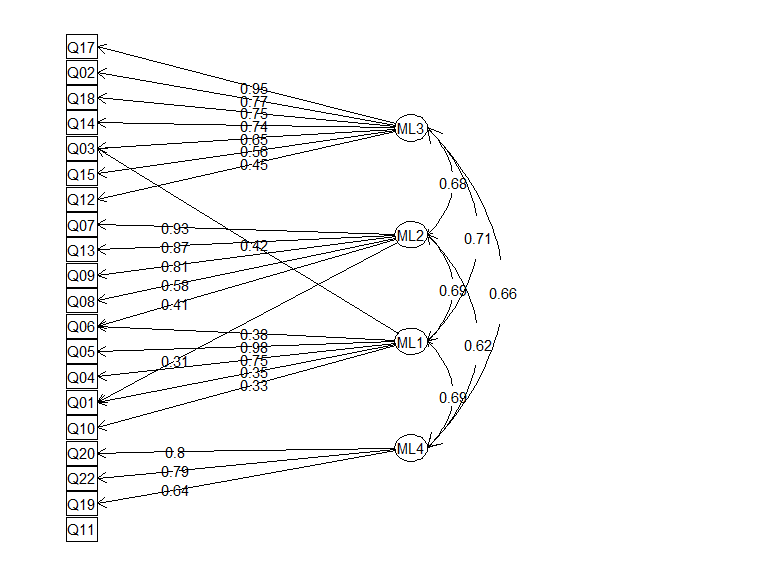

### Materials

These data were collected as part of the Programme for International Student Assessment (PISA) 2012 survey. Specifically, sub-questionnaire SC34 asked school principals to report how often they performed certain leadership activities during the previous academic year. Respondants rated the frequency on a scale from 1 ("did not occur") to 6 ("more than once a week"). A subset of 20 items from SC34 were used in the present analysis. A complete list of survey items and scale levels are presented in Appendix A. The short-hand description of each item, used throughout this analysis are all defined in Appendix A.

All analyses were performed in `R` (vers. 3.2.2). Exploratory factor analysis was conducted using the `psych` package (vers. 1.5.8), and confirmatory factor analysis was performed using `lavaan` (vers. 0.5.18).

### Participants

Responses from 4978 school principals were collected for analysis. Missing data (items without responses) were treated using listwise deletion, yielding a final sample size of 4425 and a participants-per-item ratio of 221.

### Exploratory factor analysis

We initially explored the factor structure of the data using principal components analysis. The eigenvalue decomposition, shown in the scree-plot in Figure 1, suggests that 3-4 factors may underlie the data. The first five components respectively explained 49.65%, 7.32%, 6.41%, 5.05%, and 4.12% of the variance.


Next, we conducted a series of exploratory factor analyses, examining models with 1, 2, 3, and 4 underlying factors. All analyses used promax (oblique) rotation. The first series of analyses used principal axis factoring. A second series used maximum likelihood in order to statistically test whether the number of factors in each model was sufficient. Item Q07 ("discuss problems") presented a Heywood case for the 2-factor models, so it was dropped from the 2- and 3-factor models.

None of the maximum likelihood models provided an adequate fit of the items, according to *χ*<sup>2</sup> statistics. The measures of model fit for four maximum likelihood models are presented in Table 1.

|  Factors|  Degrees|  *χ*<sup>2</sup>|     *p*|       BIC|  RMSEA|
|--------:|--------:|----------------:|-------:|---------:|------:|
|        1|      170|         16513.99|  \< .01|  15086.83|   0.15|
|        2|      134|         10186.93|  \< .01|   9062.00|   0.13|
|        3|      117|          7728.95|  \< .01|   6746.73|   0.12|
|        4|      116|          6669.21|  \< .01|   5695.38|   0.11|

The 4-factor model provided the best fit of the data. The loadings for the maximum likelihood 4-factor are presented in Table 2. Similar tables for the 1-, 2- and 3-factor maximum likelihood models are presented in Appendix B.

| Item | Description                 |  Culture|  Solving|  Teaching|  Oversight|
|:-----|:----------------------------|--------:|--------:|---------:|----------:|
| Q17  | attend-in-services          |  **.95**|     -.09|      -.16|       -.01|
| Q02  | performance-informs-goals   |  **.77**|     -.07|       .17|       -.13|
| Q18  | teachers-share-ideas        |  **.75**|      .06|      -.12|        .03|
| Q14  | goals-inform-meetings       |  **.74**|     -.05|      -.13|        .20|
| Q03  | prof-dev-follow-goals       |  **.65**|     -.20|   **.42**|       -.13|
| Q15  | goals-inform-curriculum     |  **.56**|      .21|       .01|        .14|
| Q12  | teachers-review-management  |  **.45**|      .25|      -.07|        .16|
| Q07  | discuss-problems            |     -.18|  **.93**|      -.06|        .20|
| Q13  | solve-problems-together     |      .03|  **.87**|      -.03|       -.02|
| Q09  | disrupt-behavior            |      .06|  **.81**|      -.06|       -.27|
| Q08  | develop-socially            |      .06|  **.58**|       .04|        .21|
| Q06  | praise-when-students-active |     -.09|  **.41**|       .38|        .19|
| Q05  | research-based-teaching     |     -.07|     -.04|   **.98**|       -.03|
| Q04  | teachers-follow-goals       |      .01|     -.04|   **.75**|        .11|
| Q01  | enhance-reputation          |      .17|      .31|       .35|       -.16|
| Q10  | staff-help-decide           |      .28|     -.01|       .33|        .24|
| Q20  | review-student-work         |      .16|      .06|      -.21|    **.80**|
| Q22  | evaluate-staff-performance  |     -.05|     -.06|       .05|    **.79**|
| Q19  | informal-observation        |     -.08|      .00|       .25|    **.64**|
| Q11  | continuous-improvement      |      .21|      .15|       .23|        .27|

The factors for the four-factor model demonstrated face validity. That is, items clustered together in somewhat coherent and interpretable way. The four possible factors and items indicating each are listed below:

-   *Meeting culture:* attend in-services, teachers share ideas, goals inform meetings, among others.
-   *Problem solving:* discuss problems, solve problems together, develop socially, among others.
-   *Teaching practices:* research based teaching and teachers follow goals.
-   *Oversight:* review student work, evaluate staff performance and informal observation.

The four factors were all moderated correlated with each other (range of correlations: 0.55--0.74). This factor structure is plotted in Figure 2.



Although these factors can be interpreted at face value, the 4-factor solution did not neatly partition the items. The following items did not load particularly strongly to any factor: continuous improvement, staff help decide, and enhance reputation. Moreover, the following item had high loadings on more than one factor: professional development follows goals, praise when students active, and enhance reputation. These items suggest the need for possible cross-loadings in later analyses.

Confirmatory Factor Analysis
----------------------------

We performed a confirmatory factor analysis on the 4-factor model with a simple structure. That is, each item acted as an indicator for exactly one factor. The hypothesized model did not provide an overall adequate fit of the data, *χ*<sup>2</sup>(164) = , *p* \< .001, CFI = 0.81, RMSEA CI = [0.12,0.13].

Accordingly, we examined modification indices to determine which cross-loadings would substantially improve model fit. As expected, items with strong secondary loadings or with relatively weak primary loadings had large modification indices. For example, "I praise teachers whose students are actively participating in learning" primarily loaded onto the hypothetical problem-solving factor, but model fit would improve substantially if it also loaded on the teaching practices factor. This result was not surprising as this item is ambiguous: Answers to this question might have tapped into the importance of positive classroom environments and also of certain teaching practices.

The item "I engage teachers to help build a school culture of continuous improvement" very weakly loaded onto all four factors in the exploratory factor analysis. As a result, this non-specific item had high modification indices as an indicator of the factors related to teaching practices and "meeting culture".

Therefore, we re-estimated the model allowing two cross-loadings: 1) "praise when students active" as an indicator of the teaching practices factor, and 2) "continuous-improvement" as indicator of teaching practices.


The two added paths significantly improved model fit Δ*χ*<sup>2</sup>(2) = 1194.92, *p* \< .001, although the overall fit of this model was less than adequate, *χ*<sup>2</sup>(162) = , *p* \< .001, CFI = 0.83, RMSEA CI = [0.12,0.12]. The updated model is shown in Figure 3.

The `lavaan` output for this model is presented in Appendix 3. We will not interpret the results of model in detail because the model is not a good fit of the data and some of the strongest item-factor loadings were mentioned in the EFA section earlier.

------------------------------------------------------------------------

Appendix A: Items
-----------------

**Question stem**

> Below are statements about your management of this school. Please indicate the frequency of the following activities and behaviors in your school during the last academic year. (Please tick only one box in each row.)

| Response                  |  Value|
|:--------------------------|------:|
| Did not occur             |      1|
| 1-2 times during the year |      2|
| 3-4 times during the year |      3|
| Once a month              |      4|
| Once a week               |      5|
| More than once a week     |      6|

| Item | Short Name                  | Question                                                                                                                                                                                               |
|:-----|:----------------------------|:-------------------------------------------------------------------------------------------------------------------------------------------------------------------------------------------------------|
| Q01  | enhance-reputation          | I work to enhance the school's reputation in the community.                                                                                                                                            |
| Q02  | performance-informs-goals   | I use student performance results to develop the school's educational goals.                                                                                                                           |
| Q03  | prof-dev-follow-goals       | I make sure that the professional development activities of teachers are in accordance with the teaching goals of the school.                                                                          |
| Q04  | teachers-follow-goals       | I ensure that teachers work according to the school's educational goals.                                                                                                                               |
| Q05  | research-based-teaching     | I promote teaching practices based on recent educational research.                                                                                                                                     |
| Q06  | praise-when-students-active | I praise teachers whose students are actively participating in learning.                                                                                                                               |
| Q07  | discuss-problems            | When a teacher has problems in his/her classroom, I take the initiative to discuss matters.                                                                                                            |
| Q08  | develop-socially            | I draw teachers' attention to the importance of pupils' development of critical and social capacities.                                                                                                 |
| Q09  | disrupt-behavior            | I pay attention to disruptive behavior in classrooms.                                                                                                                                                  |
| Q10  | staff-help-decide           | I provide staff with opportunities to participate in school decision making.                                                                                                                           |
| Q11  | continuous-improvement      | I engage teachers to help build a school culture of continuous improvement.                                                                                                                            |
| Q12  | teachers-review-management  | I ask teachers to participate in reviewing management practices.                                                                                                                                       |
| Q13  | solve-problems-together     | When a teacher brings up a classroom problem, we solve the problem together.                                                                                                                           |
| Q14  | goals-inform-meetings       | I discuss the school's academic goals with teachers at faculty meetings.                                                                                                                               |
| Q15  | goals-inform-curriculum     | I refer to the school's academic goals when making curricular decisions with teachers.                                                                                                                 |
| Q17  | attend-in-services          | I lead or attend in-service activities concerned with instruction.                                                                                                                                     |
| Q18  | teachers-share-ideas        | I set aside time at faculty meetings for teachers to share ideas or information from ins-service activities.                                                                                           |
| Q19  | informal-observation        | I conduct informal observations in classrooms on a regular basis (informal observations are unscheduled, last at least 5 minutes, and may or may not involve written feedback or a formal conference). |
| Q20  | review-student-work         | I review work produced by students when evaluating classroom instruction.                                                                                                                              |
| Q22  | evaluate-staff-performance  | I evaluate the performance of staff.                                                                                                                                                                   |

Appendix B: Maximum Likelihood models
-------------------------------------

| Item | Description                 |      ML1|
|:-----|:----------------------------|--------:|
| Q15  | goals-inform-curriculum     |  **.80**|
| Q06  | praise-when-students-active |  **.76**|
| Q11  | continuous-improvement      |  **.76**|
| Q08  | develop-socially            |  **.76**|
| Q10  | staff-help-decide           |  **.74**|
| Q07  | discuss-problems            |  **.73**|
| Q13  | solve-problems-together     |  **.73**|
| Q05  | research-based-teaching     |  **.72**|
| Q04  | teachers-follow-goals       |  **.71**|
| Q12  | teachers-review-management  |  **.70**|
| Q19  | informal-observation        |  **.67**|
| Q03  | prof-dev-follow-goals       |  **.67**|
| Q20  | review-student-work         |  **.67**|
| Q14  | goals-inform-meetings       |  **.67**|
| Q02  | performance-informs-goals   |  **.67**|
| Q18  | teachers-share-ideas        |  **.64**|
| Q17  | attend-in-services          |  **.61**|
| Q22  | evaluate-staff-performance  |  **.59**|
| Q01  | enhance-reputation          |  **.59**|
| Q09  | disrupt-behavior            |  **.47**|

| Item | Description                 |      ML1|      ML2|
|:-----|:----------------------------|--------:|--------:|
| Q06  | praise-when-students-active |  **.87**|     -.11|
| Q05  | research-based-teaching     |  **.84**|     -.11|
| Q19  | informal-observation        |  **.77**|     -.08|
| Q04  | teachers-follow-goals       |  **.77**|     -.03|
| Q11  | continuous-improvement      |  **.72**|      .07|
| Q08  | develop-socially            |  **.70**|      .06|
| Q13  | solve-problems-together     |  **.68**|      .04|
| Q10  | staff-help-decide           |  **.64**|      .13|
| Q22  | evaluate-staff-performance  |  **.61**|     -.00|
| Q20  | review-student-work         |  **.56**|      .14|
| Q01  | enhance-reputation          |  **.55**|      .05|
| Q12  | teachers-review-management  |  **.41**|      .34|
| Q09  | disrupt-behavior            |      .39|      .07|
| Q17  | attend-in-services          |     -.21|  **.95**|
| Q18  | teachers-share-ideas        |     -.04|  **.79**|
| Q14  | goals-inform-meetings       |      .07|  **.70**|
| Q02  | performance-informs-goals   |      .12|  **.64**|
| Q15  | goals-inform-curriculum     |  **.40**|  **.48**|
| Q03  | prof-dev-follow-goals       |      .28|  **.47**|

| Item | Description                 |      ML1|      ML3|      ML2|
|:-----|:----------------------------|--------:|--------:|--------:|
| Q05  | research-based-teaching     |  **.91**|     -.13|     -.04|
| Q04  | teachers-follow-goals       |  **.87**|     -.04|     -.09|
| Q19  | informal-observation        |  **.80**|     -.08|     -.03|
| Q22  | evaluate-staff-performance  |  **.71**|      .02|     -.14|
| Q06  | praise-when-students-active |  **.70**|     -.10|      .21|
| Q10  | staff-help-decide           |  **.62**|      .17|     -.01|
| Q11  | continuous-improvement      |  **.57**|      .09|      .18|
| Q20  | review-student-work         |  **.52**|      .17|      .01|
| Q08  | develop-socially            |  **.42**|      .06|      .35|
| Q01  | enhance-reputation          |      .36|      .06|      .23|
| Q17  | attend-in-services          |     -.21|  **.98**|     -.06|
| Q18  | teachers-share-ideas        |     -.10|  **.80**|      .05|
| Q14  | goals-inform-meetings       |      .07|  **.75**|     -.07|
| Q02  | performance-informs-goals   |      .12|  **.69**|     -.06|
| Q03  | prof-dev-follow-goals       |      .35|  **.52**|     -.15|
| Q15  | goals-inform-curriculum     |      .21|  **.51**|      .19|
| Q12  | teachers-review-management  |      .19|      .36|      .25|
| Q13  | solve-problems-together     |      .06|     -.07|  **.94**|
| Q09  | disrupt-behavior            |     -.15|      .01|  **.75**|

Appendix C: `lavaan` output for the final model
-----------------------------------------------

    ## lavaan (0.5-18) converged normally after  46 iterations
    ## 
    ##   Number of observations                          4425
    ## 
    ##   Estimator                                         ML
    ##   Minimum Function Test Statistic            10271.977
    ##   Degrees of freedom                               162
    ##   P-value (Chi-square)                           0.000
    ## 
    ## Model test baseline model:
    ## 
    ##   Minimum Function Test Statistic            61085.924
    ##   Degrees of freedom                               190
    ##   P-value                                        0.000
    ## 
    ## User model versus baseline model:
    ## 
    ##   Comparative Fit Index (CFI)                    0.834
    ##   Tucker-Lewis Index (TLI)                       0.805
    ## 
    ## Loglikelihood and Information Criteria:
    ## 
    ##   Loglikelihood user model (H0)             -119823.543
    ##   Loglikelihood unrestricted model (H1)     -114687.555
    ## 
    ##   Number of free parameters                         48
    ##   Akaike (AIC)                              239743.087
    ##   Bayesian (BIC)                            240050.048
    ##   Sample-size adjusted Bayesian (BIC)       239897.523
    ## 
    ## Root Mean Square Error of Approximation:
    ## 
    ##   RMSEA                                          0.119
    ##   90 Percent Confidence Interval          0.117  0.121
    ##   P-value RMSEA <= 0.05                          0.000
    ## 
    ## Standardized Root Mean Square Residual:
    ## 
    ##   SRMR                                           0.061
    ## 
    ## Parameter estimates:
    ## 
    ##   Information                                 Expected
    ##   Standard Errors                             Standard
    ## 
    ##                    Estimate  Std.err  Z-value  P(>|z|)   Std.lv  Std.all
    ## Latent variables:
    ##   Culture =~
    ##     Q17               1.000                               0.862    0.718
    ##     Q02               1.167    0.024   48.095    0.000    1.005    0.752
    ##     Q18               1.015    0.022   45.204    0.000    0.874    0.707
    ##     Q14               0.862    0.018   47.139    0.000    0.742    0.737
    ##     Q03               1.063    0.023   45.909    0.000    0.916    0.718
    ##     Q15               1.224    0.023   53.052    0.000    1.055    0.830
    ##     Q12               1.242    0.028   44.626    0.000    1.070    0.698
    ##   Oversight =~
    ##     Q20               1.000                               1.233    0.763
    ##     Q22               0.911    0.019   47.047    0.000    1.124    0.735
    ##     Q19               0.801    0.016   51.171    0.000    0.988    0.803
    ##     Q11               0.176    0.021    8.477    0.000    0.216    0.201
    ##   Solving =~
    ##     Q07               1.000                               1.025    0.900
    ##     Q13               0.906    0.013   72.221    0.000    0.928    0.830
    ##     Q09               0.632    0.015   43.331    0.000    0.648    0.592
    ##     Q08               1.031    0.015   68.520    0.000    1.057    0.805
    ##     Q06               0.425    0.020   20.760    0.000    0.436    0.365
    ##   Teaching =~
    ##     Q05               1.000                               1.112    0.794
    ##     Q04               0.886    0.016   55.346    0.000    0.985    0.775
    ##     Q01               0.607    0.015   40.462    0.000    0.675    0.596
    ##     Q10               0.817    0.015   54.157    0.000    0.909    0.762
    ##     Q06               0.530    0.020   26.957    0.000    0.589    0.494
    ##     Q11               0.579    0.023   24.902    0.000    0.644    0.599
    ## 
    ## Covariances:
    ##   Culture ~~
    ##     Oversight         0.770    0.026   29.265    0.000    0.725    0.725
    ##     Solving           0.619    0.020   31.022    0.000    0.701    0.701
    ##     Teaching          0.788    0.025   32.005    0.000    0.823    0.823
    ##   Oversight ~~
    ##     Solving           0.869    0.028   30.761    0.000    0.688    0.688
    ##     Teaching          1.084    0.034   31.645    0.000    0.791    0.791
    ##   Solving ~~
    ##     Teaching          0.848    0.025   33.334    0.000    0.744    0.744
    ## 
    ## Variances:
    ##     Q17               0.697    0.016                      0.697    0.484
    ##     Q02               0.776    0.019                      0.776    0.435
    ##     Q18               0.765    0.018                      0.765    0.500
    ##     Q14               0.463    0.011                      0.463    0.457
    ##     Q03               0.788    0.019                      0.788    0.485
    ##     Q15               0.502    0.014                      0.502    0.311
    ##     Q12               1.206    0.028                      1.206    0.513
    ##     Q20               1.092    0.030                      1.092    0.418
    ##     Q22               1.073    0.028                      1.073    0.459
    ##     Q19               0.536    0.017                      0.536    0.355
    ##     Q11               0.474    0.011                      0.474    0.410
    ##     Q07               0.246    0.009                      0.246    0.190
    ##     Q13               0.390    0.011                      0.390    0.312
    ##     Q09               0.777    0.017                      0.777    0.649
    ##     Q08               0.608    0.016                      0.608    0.353
    ##     Q06               0.504    0.012                      0.504    0.354
    ##     Q05               0.724    0.019                      0.724    0.369
    ##     Q04               0.644    0.016                      0.644    0.399
    ##     Q01               0.825    0.019                      0.825    0.644
    ##     Q10               0.597    0.015                      0.597    0.420
    ##     Culture           0.742    0.028                      1.000    1.000
    ##     Oversight         1.520    0.054                      1.000    1.000
    ##     Solving           1.050    0.028                      1.000    1.000
    ##     Teaching          1.236    0.040                      1.000    1.000

Appendix D: Analysis code
-------------------------

``` r
options(stringsAsFactors = FALSE)
library("magrittr")
library("dplyr")
library("stringr")
library("yaml")
library("knitr")
library("ggplot2")
library("semPlot")
library("psych")
library("lavaan")
library("readr")

# Load a codebook. This is used to generate Appendix A and item descriptions.
code_book <- yaml.load_file("data/ps2_codes.yml")
item_df <- code_book$item_codes %>%
  lapply(as_data_frame) %>%
  bind_rows %>%
  select(item, code, text)

# Load data, set 999's to NA.
d_raw <- read_csv("data/pisa12.csv", na = "999")

# Clean up column names
names(d_raw) <- names(d_raw) %>% str_replace("SC34", "")

# Listwise deletion
d <- na.omit(d_raw)

## Principal components analysis
pca <- principal(d, nfactors = 0, rotate = "none")
eigenvalues <- pca$values
variances <- print(pca)$Vaccounted["Proportion Var", ]

## Exploratory factor analysis

# DK says we should interpret the factor pattern matrix. help(fa) says "When
# factor scores are found, should they be based on the structure matrix
# (default) or the pattern matrix (oblique.scores = TRUE)." So we use the
# oblique scores in our factor analysis models.

## promax rotation + principal axis factoring
fa_pa_promax <- function(...) { 
  fa(..., rotate = "promax", fm = "pa", oblique.scores = TRUE)
}

fa_1 <- fa_pa_promax(d, nfactors = 1)
fa_2 <- fa_pa_promax(d, nfactors = 2)
# Warning message:
#    A Heywood case was detected.  Examine the loadings carefully.
fa_3 <- fa_pa_promax(d, nfactors = 3)
fa_4 <- fa_pa_promax(d, nfactors = 4)

# Drop seventh item. Re-run 2nd and 3rd analyses
d_minus_7 <- d %>% select(-Q07)
fa_2 <- fa_pa_promax(d_minus_7, nfactors = 2)
fa_3 <- fa_pa_promax(d_minus_7, nfactors = 3)

## promax rotation + maximum likelihood
fa_ml_promax <- function(...) { 
  fa(..., rotate = "promax", fm = "ml", oblique.scores = TRUE)
}
fa_ml_1 <- fa_ml_promax(d, nfactors = 1)
fa_ml_2 <- fa_ml_promax(d_minus_7, nfactors = 2)
fa_ml_3 <- fa_ml_promax(d_minus_7, nfactors = 3)
fa_ml_4 <- fa_ml_promax(d, nfactors = 4)

# Factor correlations and range of correlation values for write-up
f_cor <- fa_ml_4$score.cor
f_cor_range <- f_cor[lower.tri(f_cor)] %>% range %>% round(2)

## Make a model comparison table, like `anova(...)` does.
extract_fits <- function(fa_ml) {
  fit_measures <- c("factors", "dof", "STATISTIC", "PVAL", "BIC", "RMSEA")
  fits <- fa_ml[fit_measures]
  # ignore CIs
  fits$RMSEA <- fits$RMSEA["RMSEA"]
  as_data_frame(fits)
}

model_summary <- list(fa_ml_1, fa_ml_2, fa_ml_3, fa_ml_4) %>% 
  lapply(extract_fits) %>% 
  bind_rows %>% 
  round(2) %>% 
  mutate(PVAL = ifelse(PVAL < 0.01, "< .01", PVAL))

## Prep for CFA by reducing EFA loadings to simple structure (have each item
## load onto its primary factor)

# Assign English names to factors (kind of hacky to do this)
fa_ml_4b <- fa_ml_4
colnames(fa_ml_4b$loadings) <- c("Culture", "Solving", "Teaching", "Oversight")

# Extract EFA loadings
efa_loadings <- fa_ml_4b %>% 
  fa.sort %>%  
  extract2("loadings") %>% 
  unclass 

# Assign each item to a primary factor based on its strongest loading
largest_columns <- apply(efa_loadings, 1, which.max)
primary_factors <- colnames(efa_loadings)[largest_columns]

# Combine item labels (hidden in row-names of loadings) and primary factors
primary_df <- efa_loadings %>% 
  as.data.frame %>%
  add_rownames("Item") %>% 
  mutate(Factor = primary_factors) %>% 
  select(Item, Factor)

# Generate the CFA equation pasting together the items within each factor
cfa_formula <- primary_df %>% 
  group_by(Factor) %>% 
  summarize(RHS = paste(Item, collapse = " + ")) %>% 
  transmute(equation = sprintf("%s =~ %s", Factor, RHS)) %>% 
  # Convert from data-frame to single string
  extract2("equation") %>% 
  paste0(collapse = "\n")

## CFA
cfa_fit <- cfa(cfa_formula, d)
summary(cfa_fit, fit.measures = TRUE, standardized = TRUE)

# Get the top modification indices
round2 <- function(xs) round(xs, 2)

mods <- cfa_fit %>% 
  modindices(standardized = TRUE, power = TRUE, delta = 0.1, 
             alpha = .05, high.power = .80) %>% 
  as_data_frame %>% 
  mutate_each(funs(round2), mi:power) %>% 
  filter(op == "=~") %>% 
  arrange(desc(mi))

# Update the formula. lavaan combines equations together, apparently. Refit.
cfa_formula2 <- paste0(cfa_formula, "\nTeaching =~ Q06 + Q11")
cfa_fit2 <- cfa(cfa_formula2, d)
summary(cfa_fit2, fit.measures = TRUE, standardized = TRUE)

# Fit measures and model comparison for write-up
fits <- fitmeasures(cfa_fit) %>% round(2) %>% as.list
fits2 <- fitmeasures(cfa_fit2) %>% round(2) %>% as.list
comp <- anova(cfa_fit, cfa_fit2)[2, ] %>% round(2) %>% as.list
```
